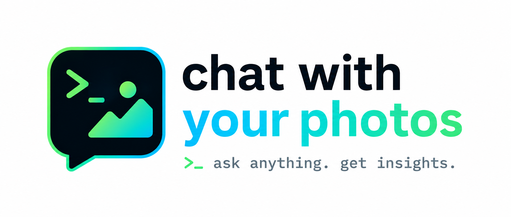

<p align="center">
  
</p>
<p align="center">Ask natural-language questions about your personal photo collection directly from the terminal.</p>

---

<p align="center">Demo</p>
<p align="center">
  
</p>

*No manual annotations needed! Your photos already contain all required information!*

Example questions:
```
> "What places did I visit?"
> "How many photos did I take in the last 7 days of my trip?"
> "What animals are in the photos?"
> "Create a trajectory map of my Mallorca holiday!"
> "Create a postcard with the animals I saw in Africa!"
```

The app indexes your photos once (reading EXIF metadata and labeling each image), then lets an LLM agent answer queries against that index — fast, without loading every image at query time.
The index is a single CSV file stored on your file system. No embeddings or database needed!

The app can be run using popular LLM APIs or fully local using Ollama.

## Getting started

**1. Setup LLM provider**

For Anthropic or OpenAI models, create a `.env` file in the project root and add one of:

```
ANTHROPIC_API_KEY=...
OPENAI_API_KEY=...
```

For [Ollama](https://ollama.com), simply install Ollama and download the desired model, e.g., [gemma4:e2b](https://ollama.com/library/gemma4:e2b).

**2. Run**

Requires [uv](https://docs.astral.sh/uv/).

```bash
uv sync
uv run chatwithyourphotos
```

On first launch, choose **Add a new folder** and point it at your photos directory. The app walks the folder, reads EXIF data, labels every image, and saves an index. Subsequent launches can go straight to the chat with this collection.

---

## How it works

**Indexing** (`setup.py`) runs in three phases:

1. Fast EXIF pass — extracts timestamps and GPS coordinates from every image
2. Batch reverse-geocode — turns GPS coordinates into country / region / city
3. Vision labeling — classifies each image with either a local ViT classifier (`timm`, very fast, recommended for large collections) or an LLM (Anthropic / OpenAI / Ollama, slower but adds a one-sentence description)

The index is saved as `{your-folder}/.cwyp/index.csv` so it travels with your photos.

**Chatting** (`agent.py`) loads the index into pandas and gives the agent tools to query it: filter by location, label, or date; get a label distribution; open individual photos; generate an HTML trajectory map; and more. Images are only loaded directly when a description needs to be generated on demand.

---

## Supported models

| Purpose | Options |
|---------|---------|
| Indexing (vision) | ViT (local, fast) · most recent Anthropic / OpenAI models · any Ollama vision model |
| Chat agent | most recent Anthropic / OpenAI models · any Ollama vision model |

Both are picked interactively at startup — no config files needed.

---

## Supported image formats

`.jpg` · `.jpeg` · `.png` · `.heic`
